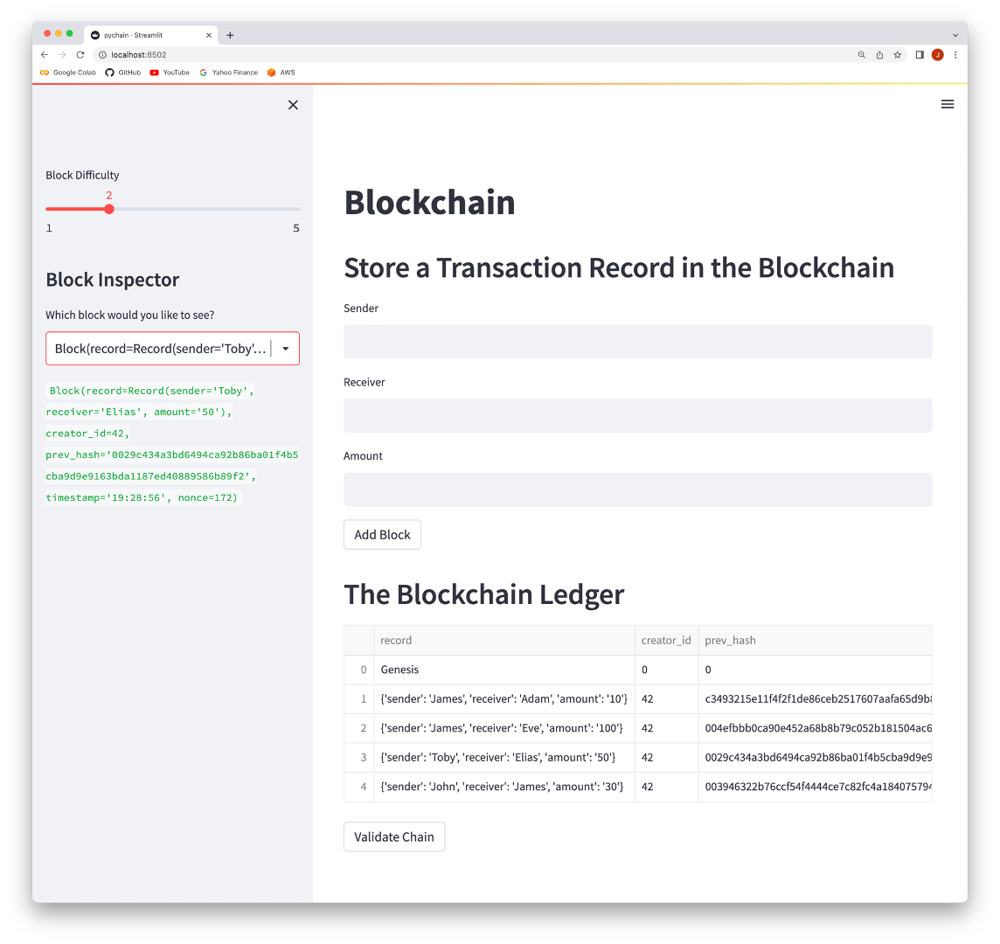
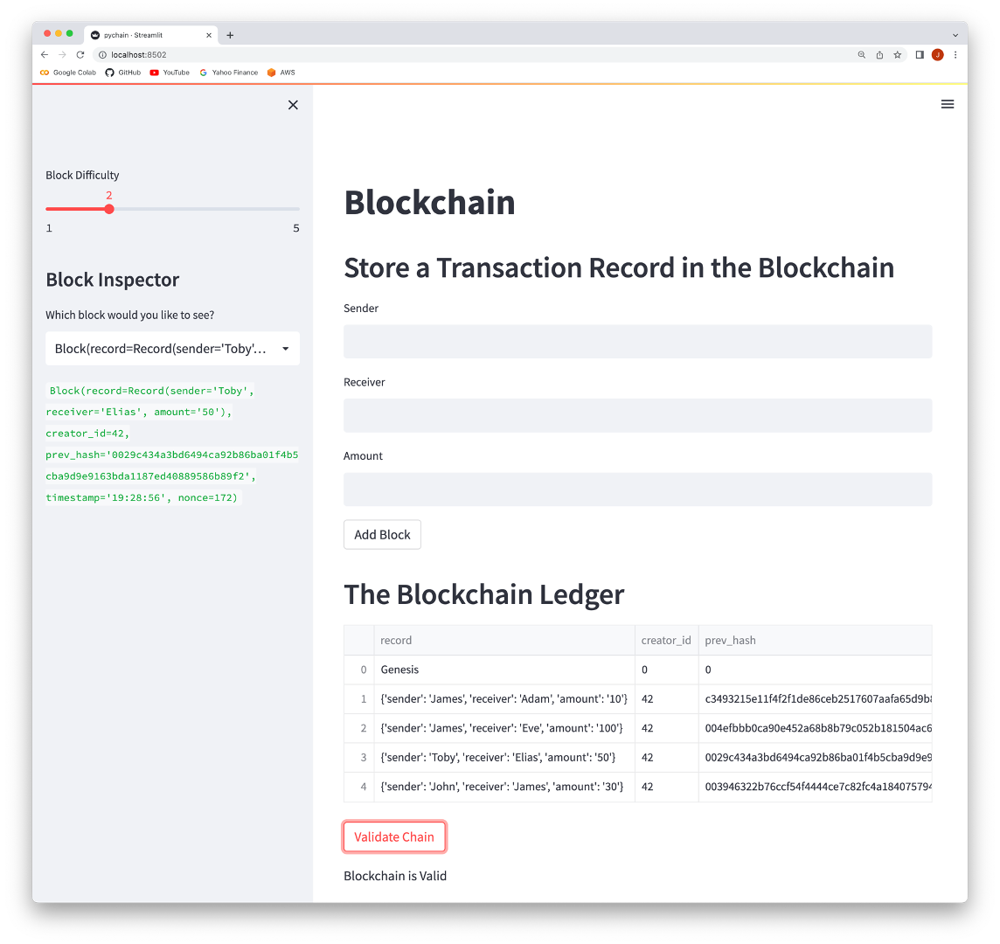

# Blockchain_Ledger

This app is a Blockchain ledger for storing sender, receiver and amount data for transactions.

It is developed using the following steps:

Step 1: Create a Record Data Class that serves as the blueprint for the financial transaction records that the blocks of the ledger will store

Step 2: Create a new data class named `Block` to Store Record Data

Step 3: Use Streamlit Interface for user inputs and to display the Blockchain ledger

 

----

## Technologies

This application uses the following package:

* [Streamlit](https://streamlit.io)

 

---

## Usage

In Windows GitBash or Mac Terminal app, run "streamlit run pychain.py". This will launch the default browser showing the Blockchain Ledger.

Transactions can be added as shown in the following image:

 

The blockchain can be validated by clicking on the 'Validate Chain' button. If the blockchain has been tampered with, the message will show 'Blockchain is invalid!'.

 

---

## Contributors

This application is written by James Tan, with code snippets provided UBC Extension.

 

---

## License

MIT.